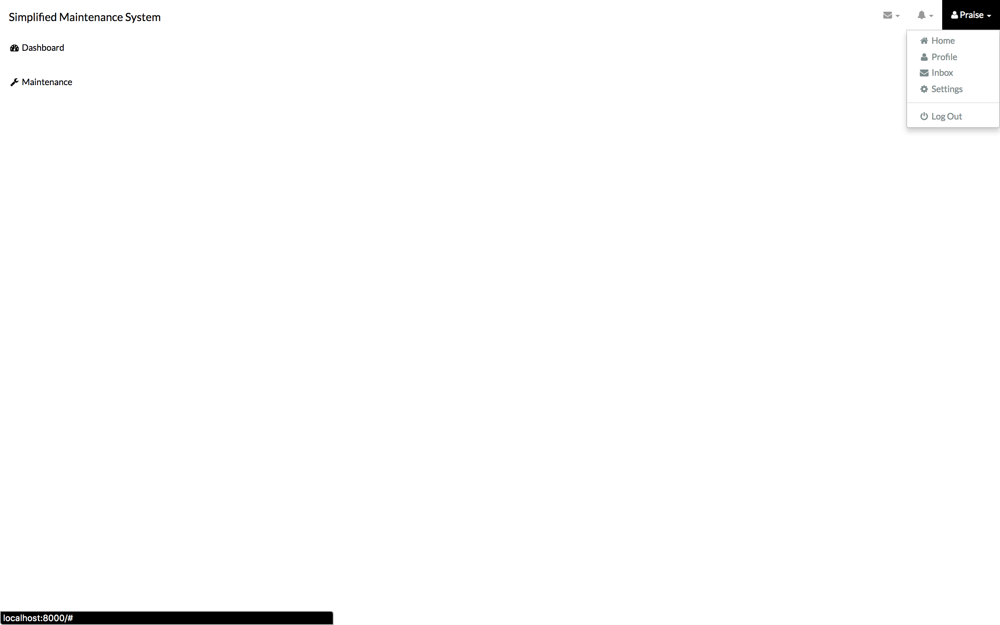

# Simplified Maintenance Management System
## This is a prototype of a generic maintenance request and tracking system (NEVER COMPLETED).
## Built with Django/Python and Bootstrap

### Application Tour

##### 0. Login

<kbd></kbd>

##### 1. Register

<kbd></kbd>

##### 2. Homepage(So empty!!)

<kbd></kbd>

##### 3. Dashboard

<kbd></kbd>

##### 4. Logging a maintenance request

<kbd></kbd>

##### 5. Confirmation page

<kbd></kbd>

##### 6. Current Maintenance Request View

<kbd></kbd>

## Getting the App to Work Locally
### Prerequisites

### Note: You need to be in the project's folder when executing any of these comamnds


### Installing the application dependencies(You need to be connected to the internet for this)

```
  chmod +x runproject.sh setup.sh
  ./setup.sh

```

### Running the app locally(You can  find it here in your web browser: localhost:8000)
```
    ./runproject.sh

```

### Authors
   Praise Tompane
   
### Licence
    This project is licensed under the GNU License - see the [LICENSE.md](LICENSE.md) file for details
       
### Acknowledgments
##### https://github.com/narenaryan/django-auth-pattern for the base code for authentication
